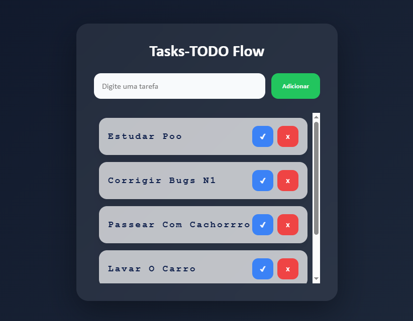

# To-Do API ✅

Aplicação Full Stack de gerenciamento de tarefas desenvolvida para praticar CRUD, APIs REST e integração com banco de dados.

## Preview



- Criar tarefas
- Marcar como concluída
- Excluir tarefas
- Persistência com SQLite

---

## Tecnologias utilizadas

### Backend
- Node.js
- Express
- SQLite

### Frontend
- HTML5
- CSS3
- JavaScript

---

## Estrutura do projeto

```bash
todo-api/
│
├── public/
│   ├── index.html
│   ├── style.css
│   └── script.js
│
├── src/
│   ├── controllers/
│   ├── database/
│   └── routes/
│
├── app.js
└── package.json
```

---

## Funcionalidades

- CRUD completo de tarefas
- API REST
- Interface integrada com backend
- Banco de dados local com SQLite

---

## Endpoints

### Listar tarefas
```http
GET /tasks
```

### Criar tarefa
```http
POST /tasks
```

Body:
```json
{
"title":"Estudar Node.js"
}
```

### Atualizar status
```http
PUT /tasks/:id
```

### Excluir tarefa
```http
DELETE /tasks/:id
```

---

## Instalação

Clone o projeto:

```bash
git clone https://github.com/seuusuario/taskflow-api.git
```

Entre na pasta:

```bash
cd taskflow-api
```

Instale dependências:

```bash
npm install
```

Execute:

```bash
npm run dev
```

Abrir:

```bash
http://localhost:3000
```

---

## Aprendizados

Projeto criado para praticar:

- Express Routes
- Controllers
- Integração com SQLite
- Manipulação do DOM
- Comunicação Frontend ↔ Backend
- Estruturação de APIs REST

---

## Melhorias futuras

- Editar tarefas
- Filtro por status
- Login com JWT
- Deploy
- Swagger Documentation

---

## Autor

Desenvolvido por Jonas.